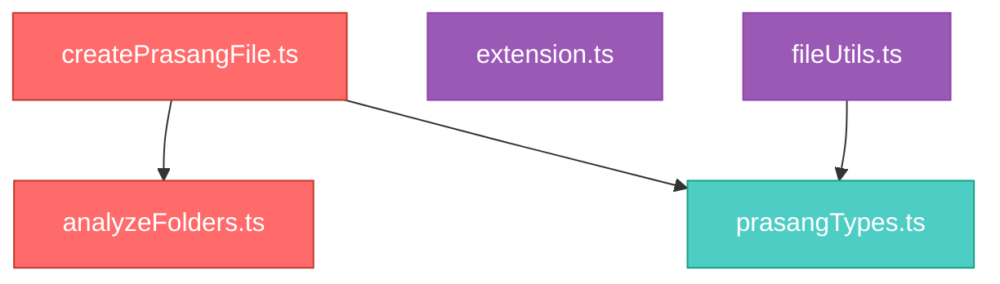

# PRASANG

## Repository Identity

**Name:** prasang-file  
**Language:** TypeScript  
**Package Manager:** npm  
**Repository Type:** VS Code Extension

## Repository Snapshot

**Type:** VS Code Extension

**Primary Language:** TypeScript

**Execution Model:** Command-driven extension runtime

**Architecture:** Standard project structure

**Primary Goal:** Generate intelligent PRASANG.md files through repository intelligence for AI-assisted development.

## Framework Intelligence

**Runtime:** VS Code Extension

**Confidence:** 50%

**Evidence**

- @types/vscode in devDependencies
- .vscodeignore in root

**Language:** TypeScript

**Build System**

- esbuild
- tsc (TypeScript compiler)

**Validation**

- ESLint
- TypeScript compiler

**Testing:** VS Code test harness

**Package Manager:** npm

## Repository Health

**Architecture Clarity:**
Weak

**Coupling Risk:**
High

**Modularity:**
Strong

**AI Readiness:**
Low

**Repository Complexity:**
Low

### Key Risks
- unclear architectural boundaries
- src/types/prasangTypes.ts has critical blast radius (8 files)
- src/intelligence/confidenceEngine.ts has critical blast radius (7 files)
- createPrasangFile.ts has high orchestration coupling
- prasangTypes.ts impacts multiple systems

### Strengths
- strong folder organization
- low repository complexity

## Architecture Flow

## Repository Intelligence Summary

prasang-file follows a layered architecture focused on repository intelligence and AI-optimized code understanding.

Execution begins in:
- src/extension.ts

Command orchestration delegates to:
- package.json → contributes.commands

Repository synthesis is centralized in:
- src/core/createPrasangFile.ts

Major responsibilities include:
- dependency intelligence
- folder intelligence
- architecture detection
- blast radius analysis

Critical modules:
- analyzeFolders.ts
- createPrasangFile.ts
- prasangTypes.ts

Risk concentration:
HIGH due to orchestration dependency centrality.

## Critical Files

- README.md
- package.json
- tsconfig.json

## Dependency Intelligence

### Runtime

- VS Code Extension Runtime
- Node.js

### Language Layer

- TypeScript

### Build Layer

- esbuild
- tsc (TypeScript compiler)

### Validation Layer

- ESLint
- TypeScript compiler

### Testing Layer

- VS Code test harness

### Package Manager

- npm

### Architectural Signals

- TypeScript-first repository
- Bundled build pipeline
- VS Code Extension Runtime

## Entry Points

### Runtime Entry (VS Code)

- src/extension.ts  
  VS Code extension activation entrypoint  
  **Confidence:** 70%

### Command Registry (VS Code)

- package.json → contributes.commands  
  Registers 1 VS Code command(s): Generate PRASANG File  
  **Confidence:** 25%

## System Relationships

### Runtime Flow

src/extension.ts
→ src/commands/generatePrasangCommand.ts

src/commands/generatePrasangCommand.ts
→ src/core/createPrasangFile.ts

src/core/createPrasangFile.ts
→ src/core/analyzeArchitecturePattern.ts
→ src/core/analyzeBlastRadius.ts
→ src/core/analyzeDependencies.ts
→ src/core/analyzeEntryPoints.ts
→ src/core/analyzeFolders.ts
→ src/core/analyzeHighImpact.ts
→ src/core/analyzeImports.ts
→ src/core/analyzeRepository.ts
→ src/core/analyzeRepositorySummary.ts
→ src/intelligence/aiAdvisor.ts
→ src/intelligence/frameworkFingerprinting.ts
→ src/types/prasangTypes.ts

src/core/analyzeArchitecturePattern.ts
→ src/core/analyzeFolders.ts
→ src/types/prasangTypes.ts

src/core/analyzeBlastRadius.ts
→ src/core/analyzeFolders.ts
→ src/types/prasangTypes.ts

src/core/analyzeEntryPoints.ts
→ src/intelligence/confidenceEngine.ts

src/core/analyzeFolders.ts
→ src/core/analyzeImports.ts
→ src/intelligence/confidenceEngine.ts
→ src/intelligence/folderTaxonomy.ts

src/core/analyzeRepository.ts
→ src/types/prasangTypes.ts

src/intelligence/aiAdvisor.ts
→ src/types/prasangTypes.ts

### FileUtils Flow

src/utils/fileUtils.ts
→ src/types/prasangTypes.ts

## High Impact Files

### Orchestrators

- src/core/analyzeFolders.ts — imports 3 local modules: src/core/analyzeImports.ts, src/intelligence/confidenceEngine.ts, src/intelligence/folderTaxonomy.ts
- src/core/createPrasangFile.ts — imports 12 local modules: src/core/analyzeArchitecturePattern.ts, src/core/analyzeBlastRadius.ts, src/core/analyzeDependencies.ts, src/core/analyzeEntryPoints.ts, src/core/analyzeFolders.ts, src/core/analyzeHighImpact.ts, src/core/analyzeImports.ts, src/core/analyzeRepository.ts, src/core/analyzeRepositorySummary.ts, src/intelligence/aiAdvisor.ts, src/intelligence/frameworkFingerprinting.ts, src/types/prasangTypes.ts

### Hubs

- src/types/prasangTypes.ts — imported by 6 files: src/core/analyzeArchitecturePattern.ts, src/core/analyzeBlastRadius.ts, src/core/analyzeRepository.ts, src/core/createPrasangFile.ts, src/intelligence/aiAdvisor.ts, src/utils/fileUtils.ts

### Entry Points

- src/extension.ts — root node, imports 1 module(s)
- src/utils/fileUtils.ts — root node, imports 1 module(s)

## Blast Radius

src/types/prasangTypes.ts

**Direct Impact**
- src/core/analyzeArchitecturePattern.ts (Repository analysis logic)
- src/core/analyzeBlastRadius.ts (Repository analysis logic)
- src/core/analyzeRepository.ts (Repository analysis logic)
- src/core/createPrasangFile.ts (Repository analysis logic)
- src/intelligence/aiAdvisor.ts (Repository intelligence layer)
- src/utils/fileUtils.ts (Shared helper utilities)

**Indirect Impact**
- src/commands/generatePrasangCommand.ts (VS Code command orchestration)
- src/extension.ts (Primary application source code)

src/intelligence/confidenceEngine.ts

**Direct Impact**
- src/core/analyzeEntryPoints.ts (Repository analysis logic)
- src/core/analyzeFolders.ts (Repository analysis logic)

**Indirect Impact**
- src/commands/generatePrasangCommand.ts (VS Code command orchestration)
- src/core/analyzeArchitecturePattern.ts (Repository analysis logic)
- src/core/analyzeBlastRadius.ts (Repository analysis logic)
- src/core/createPrasangFile.ts (Repository analysis logic)
- src/extension.ts (Primary application source code)

src/core/analyzeImports.ts

**Direct Impact**
- src/core/analyzeFolders.ts (Repository analysis logic)
- src/core/createPrasangFile.ts (Repository analysis logic)

**Indirect Impact**
- src/commands/generatePrasangCommand.ts (VS Code command orchestration)
- src/core/analyzeArchitecturePattern.ts (Repository analysis logic)
- src/core/analyzeBlastRadius.ts (Repository analysis logic)
- src/extension.ts (Primary application source code)

src/intelligence/folderTaxonomy.ts

**Direct Impact**
- src/core/analyzeFolders.ts (Repository analysis logic)

**Indirect Impact**
- src/commands/generatePrasangCommand.ts (VS Code command orchestration)
- src/core/analyzeArchitecturePattern.ts (Repository analysis logic)
- src/core/analyzeBlastRadius.ts (Repository analysis logic)
- src/core/createPrasangFile.ts (Repository analysis logic)
- src/extension.ts (Primary application source code)

src/core/analyzeFolders.ts

**Direct Impact**
- src/core/analyzeArchitecturePattern.ts (Repository analysis logic)
- src/core/analyzeBlastRadius.ts (Repository analysis logic)
- src/core/createPrasangFile.ts (Repository analysis logic)

**Indirect Impact**
- src/commands/generatePrasangCommand.ts (VS Code command orchestration)
- src/extension.ts (Primary application source code)

src/core/analyzeArchitecturePattern.ts

**Direct Impact**
- src/core/createPrasangFile.ts (Repository analysis logic)

**Indirect Impact**
- src/commands/generatePrasangCommand.ts (VS Code command orchestration)
- src/extension.ts (Primary application source code)

src/core/analyzeBlastRadius.ts

**Direct Impact**
- src/core/createPrasangFile.ts (Repository analysis logic)

**Indirect Impact**
- src/commands/generatePrasangCommand.ts (VS Code command orchestration)
- src/extension.ts (Primary application source code)

src/core/analyzeDependencies.ts

**Direct Impact**
- src/core/createPrasangFile.ts (Repository analysis logic)

**Indirect Impact**
- src/commands/generatePrasangCommand.ts (VS Code command orchestration)
- src/extension.ts (Primary application source code)

src/core/analyzeEntryPoints.ts

**Direct Impact**
- src/core/createPrasangFile.ts (Repository analysis logic)

**Indirect Impact**
- src/commands/generatePrasangCommand.ts (VS Code command orchestration)
- src/extension.ts (Primary application source code)

src/core/analyzeHighImpact.ts

**Direct Impact**
- src/core/createPrasangFile.ts (Repository analysis logic)

**Indirect Impact**
- src/commands/generatePrasangCommand.ts (VS Code command orchestration)
- src/extension.ts (Primary application source code)

src/core/analyzeRepository.ts

**Direct Impact**
- src/core/createPrasangFile.ts (Repository analysis logic)

**Indirect Impact**
- src/commands/generatePrasangCommand.ts (VS Code command orchestration)
- src/extension.ts (Primary application source code)

src/core/analyzeRepositorySummary.ts

**Direct Impact**
- src/core/createPrasangFile.ts (Repository analysis logic)

**Indirect Impact**
- src/commands/generatePrasangCommand.ts (VS Code command orchestration)
- src/extension.ts (Primary application source code)

src/intelligence/aiAdvisor.ts

**Direct Impact**
- src/core/createPrasangFile.ts (Repository analysis logic)

**Indirect Impact**
- src/commands/generatePrasangCommand.ts (VS Code command orchestration)
- src/extension.ts (Primary application source code)

src/intelligence/frameworkFingerprinting.ts

**Direct Impact**
- src/core/createPrasangFile.ts (Repository analysis logic)

**Indirect Impact**
- src/commands/generatePrasangCommand.ts (VS Code command orchestration)
- src/extension.ts (Primary application source code)

src/core/createPrasangFile.ts

**Direct Impact**
- src/commands/generatePrasangCommand.ts (VS Code command orchestration)

**Indirect Impact**
- src/extension.ts (Primary application source code)

## Folder Purpose Map

### .vscode

**Purpose:** VS Code workspace configuration  
**Role:** Workspace Configuration  
**Confidence:** 90%  

**Signals**
- vscode convention
- editor configuration

### assets

**Purpose:** Static project assets  
**Role:** Asset Layer  
**Confidence:** 40%  

**Signals**
- asset convention

### src

**Purpose:** Primary application source code  
**Role:** Application Root  
**Confidence:** 60%  

**Subdomains**
- commands
- core
- generation
- intelligence
- test
- types
- utils

**Signals**
- source folder convention
- typescript files

### src/commands

**Purpose:** VS Code command orchestration  
**Role:** Command Layer  
**Confidence:** 95%  

**Signals**
- command convention
- command file pattern
- generation file pattern
- typescript files

### src/core

**Purpose:** Repository analysis logic  
**Role:** Analysis Engine  
**Confidence:** 95%  

**Signals**
- core logic convention
- analysis file pattern
- creation file pattern
- typescript files

### src/generation

**Purpose:** Content generation layer  
**Role:** Generation Layer  
**Confidence:** 40%  

**Signals**
- generation convention

### src/intelligence

**Purpose:** Repository intelligence layer  
**Role:** Intelligence Layer  
**Confidence:** 75%  

**Signals**
- intelligence convention
- typescript files

### src/test

**Purpose:** Testing infrastructure  
**Role:** Testing  
**Confidence:** 80%  

**Signals**
- testing convention
- testing file pattern
- typescript files

### src/types

**Purpose:** Shared type definitions  
**Role:** Shared Contracts  
**Confidence:** 55%  

**Signals**
- typescript convention
- typescript files

### src/utils

**Purpose:** Shared helper utilities  
**Role:** Utility Layer  
**Confidence:** 70%  

**Signals**
- utility convention
- utility file pattern
- typescript files

