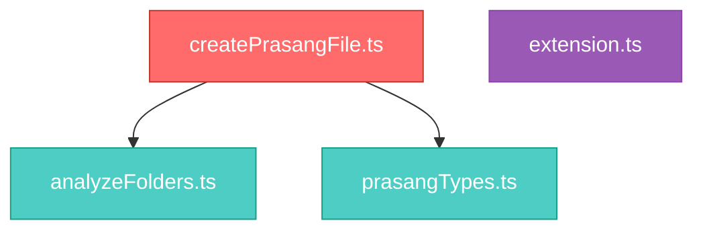

<div align="center">

# PRASANG

**Repository intelligence for AI-assisted development.**

One command. Full architectural context. Zero token waste.

<br />

[](https://marketplace.visualstudio.com/items?itemName=udaysharmadev.prasang-file)
[](https://marketplace.visualstudio.com/items?itemName=udaysharmadev.prasang-file)
[](https://github.com/udaysharmadev/prasang-file)
[](LICENSE)
[](https://www.typescriptlang.org/)

<br />

[**Install from Marketplace →**](https://marketplace.visualstudio.com/items?itemName=udaysharmadev.prasang-file)

</div>

<br />

---

## Demo

[Watch PRASANG Demo](https://raw.githubusercontent.com/udaysharmadev/prasang-file/main/assets/demo.mp4)

---

## The Problem

AI models don't understand repositories. They understand text.

When you paste code into ChatGPT, Claude, Cursor, or Copilot, the model sees syntax — not architecture. It doesn't know which files orchestrate the system, which modules carry the highest blast radius, or where execution actually begins.

The result: hallucinated imports, invented file structures, confidently wrong refactoring suggestions, and wasted context windows filled with irrelevant code.

**The core issue is simple.** AI models need repository *understanding* — architecture, dependency relationships, execution flow, system boundaries — not repository *text*. And none of that survives a raw code paste.

---

## Why Existing Approaches Fail

| Approach | Problem |
|----------|---------|
| **Paste files manually** | You pick the wrong ones. The model invents the rest. |
| **Dump the entire repo** | Context window fills with boilerplate. Signal drowns in noise. |
| **Use repo-to-text tools** | Concatenated source code without structural intelligence. Token-heavy, insight-light. |
| **Let the model guess** | It invents architecture, dependencies, and relationships. Confidently wrong. |
| **Write documentation** | Goes stale immediately. Describes intent, not structure. |

Every approach either wastes tokens or loses architecture. PRASANG does neither.

---

## What PRASANG Does

PRASANG analyzes your repository through static analysis and generates a single `PRASANG.md` file — a compressed structural intelligence document designed for AI consumption.

```
Repository
  ↓  static analysis
Repository Intelligence
  ↓  deterministic compression
PRASANG.md
  ↓  context injection
Better AI understanding
```

The output is engineered for one thing:

> **Maximum repository understanding per token.**

No prose. No filler. Every line exists because it helps AI models make better decisions about your codebase. Paste `PRASANG.md` into any model's context window — ChatGPT, Claude, Cursor, Gemini, Copilot — and watch the quality of responses improve immediately.

---

## Features

### Repository Identity

Detects language, package manager, repository type, and critical configuration files from project structure.

### Framework Intelligence

Fingerprints your technology stack with weighted evidence scoring. Identifies runtime, build system, validation, testing, and package management layers — not just dependency names.

### Dependency Intelligence

Compresses `package.json` into architectural signals. Groups dependencies by stack layer. Surfaces patterns like bundled pipelines, TypeScript-first development, and runtime environments.

### Folder Intelligence

Maps every directory to its architectural purpose, role, and confidence score using a 65+ entry taxonomy with weighted evidence. Identifies subsystem boundaries and domain separation.

### Entry Point Detection

Identifies runtime entry points, command registries, and execution roots through pattern matching and content analysis. Supports VS Code extensions, React, Next.js (App Router + Pages Router), Node.js, Express, Python, and more.

### Import Graph Intelligence

Builds a complete directed dependency graph from local imports. Groups relationships by architectural flow, traced from root nodes through the import chain. No AST parser. No external dependencies. Deterministic.

### High Impact File Classification

Classifies files by structural role in the import graph:

| Category | Criteria | Meaning |
|----------|----------|---------|
| **Orchestrator** | Imports 3+ local modules | Coordinates multiple subsystems |
| **Hub** | Imported by 3+ files | Central dependency — changes propagate widely |
| **Central Engine** | High in-degree and out-degree | Both consumed and consuming |
| **Entry Point** | Zero in-degree, positive out-degree | Root node — nothing imports it |

### Blast Radius Analysis

Computes which files are affected when a module changes. Separates **direct** (1-hop) from **indirect** (transitive) impact. Risk levels — Critical, High, Medium, Low — are assigned based on total downstream exposure.

### Architecture Visualization

Generates Mermaid diagrams directly inside `PRASANG.md`. Nodes are selected by centrality score and color-coded by structural role. Capped at 15 nodes for readability. Renders natively on GitHub.

### Repository Health

Deterministic health assessment across five dimensions: Architecture Clarity, Coupling Risk, Modularity, AI Readiness, and Repository Complexity. Surfaces specific risks and strengths with file-level attribution.

### AI Repository Advisor

Optional AI-powered engineering feedback. After deterministic analysis completes, PRASANG can send compressed context to the Gemini API for architectural recommendations — strengths, weaknesses, suggestions, and engineering risk assessment. Requires an API key. Graceful fallback when unavailable.

---

## Example Output

### Framework Intelligence

```md
## Framework Intelligence

**Runtime:** VS Code Extension
**Confidence:** 50%

**Evidence**
- @types/vscode in devDependencies
- .vscodeignore in root

**Language:** TypeScript
**Build System:** esbuild, tsc (TypeScript compiler)
**Validation:** ESLint, TypeScript compiler
**Testing:** VS Code test harness
**Package Manager:** npm
```

### Architecture Flow



### Repository Health

```md
## Repository Health

**Architecture Clarity:** Weak
**Coupling Risk:** High
**Modularity:** Strong
**AI Readiness:** Low
**Repository Complexity:** Low

### Key Risks
- confidenceEngine.ts has critical blast radius (7 files)
- prasangTypes.ts has critical blast radius (7 files)
- createPrasangFile.ts has high orchestration coupling

### Strengths
- strong folder organization
- low repository complexity
```

### AI Repository Advisor

```md
## AI Repository Advisor

**Strengths**
- strong folder separation with clear domain boundaries
- deterministic architecture with no runtime AI dependencies
- clean modular analyzers with single responsibilities

**Weaknesses**
- createPrasangFile.ts has high orchestration coupling (11 imports)
- framework intelligence can be generalized beyond Node.js

**Suggestions**
1. reduce orchestration fan-out by extracting section renderers
2. isolate repository intelligence contracts into interfaces
3. improve framework abstraction for multi-language support

**Engineering Risk:** Medium
```

---

## Installation

### VS Code Marketplace

Install directly from the marketplace:

**[PRASANG File on VS Code Marketplace →](https://marketplace.visualstudio.com/items?itemName=udaysharmadev.prasang-file)**

### Quick Install

Open VS Code and run:

```
ext install udaysharmadev.prasang-file
```

Or search **"PRASANG"** in the VS Code Extensions panel.

---

## Usage

1. Open any repository in VS Code
2. Open the Command Palette — `Cmd+Shift+P` (macOS) or `Ctrl+Shift+P` (Windows/Linux)
3. Run **Generate PRASANG File**
4. A `PRASANG.md` file is generated at the repository root

Paste the contents into any AI model's context window before asking questions about the codebase.

### AI Advisor (Optional)

To enable AI-powered recommendations, configure in VS Code Settings:

| Setting | Default | Description |
|---------|---------|-------------|
| `prasang.ai.enabled` | `false` | Enable AI Repository Advisor |
| `prasang.ai.provider` | `"gemini"` | AI provider |
| `prasang.ai.apiKey` | `""` | Your API key |

Without an API key, all deterministic features work normally. The AI section displays a graceful fallback message.

---

## Architecture Philosophy

PRASANG is built on three principles:

**Deterministic first.** Same repository, same output, every time. No randomness. Core analysis requires zero network requests, zero LLM calls, zero external services.

**Intelligence over dumping.** PRASANG doesn't concatenate source files. It computes architecture patterns, dependency graphs, blast radius, entry points, and folder semantics — then compresses them into a format optimized for AI consumption.

**AI as optional enrichment.** The AI Repository Advisor exists as an enhancement layer. It receives compressed deterministic context — not raw code. It enriches output; it never gates it. If the API is unavailable, nothing breaks.

---

## How It Differs From Code Dumping

|  | Repo-to-text tools | PRASANG |
|---|---|---|
| **Output** | Raw source files concatenated | Compressed structural intelligence |
| **Token usage** | Fills context window with syntax | Maximizes understanding per token |
| **Architecture** | Lost in the noise | Explicitly mapped with Mermaid diagrams |
| **Relationships** | Not represented | Directed import graph with flow grouping |
| **Impact analysis** | Not available | Direct + indirect blast radius per file |
| **Health metrics** | Not available | Five-dimension deterministic health scoring |
| **Determinism** | Varies | Same input → same output, always |

---

## Roadmap

- [x] Repository identity detection
- [x] Framework fingerprinting with evidence scoring
- [x] Dependency intelligence with stack layer grouping
- [x] Folder intelligence with 65+ entry taxonomy
- [x] Entry point detection (VS Code, React, Next.js, Node.js, Python)
- [x] Import graph construction with enriched adjacency maps
- [x] High impact file classification (Orchestrator, Hub, Central Engine, Entry Point)
- [x] Blast radius analysis with direct/indirect separation
- [x] Architecture pattern detection (Layered, MVC, Feature-First, Clean, Hexagonal)
- [x] Mermaid architecture visualization with category-based node styling
- [x] Repository health scoring (5 dimensions)
- [x] AI Repository Advisor (Gemini integration)
- [ ] Multi-language support — Go, Rust, Java, Python entry patterns and import graphs
- [ ] Git intelligence — change frequency, ownership signals, modification hotspots
- [ ] AST cognition layer — export analysis, function signatures, type relationship mapping
- [ ] Monorepo intelligence — cross-package dependency mapping and workspace analysis
- [ ] Configuration intelligence — environment detection, feature flags, build awareness
- [ ] Custom output profiles — configurable sections and compression levels

---

## Contributing

Contributions are welcome. If you're interested in improving repository intelligence:

1. Fork the repository
2. Create a feature branch
3. Ensure `npm run package` passes (type check + lint + production build)
4. Submit a pull request

Please keep changes deterministic and debuggable. Avoid introducing external parser dependencies unless strictly necessary. TypeScript strict mode is enforced.

[Open an issue →](https://github.com/udaysharmadev/prasang-file/issues)

---

<div align="center">

<br />

**If PRASANG helps your AI workflow, [give it a star on GitHub](https://github.com/udaysharmadev/prasang-file).**

It helps others discover the project.

<br />

[**Install from VS Code Marketplace →**](https://marketplace.visualstudio.com/items?itemName=udaysharmadev.prasang-file)

<br />

MIT License

</div>
